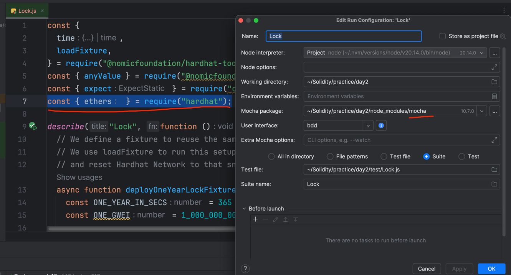
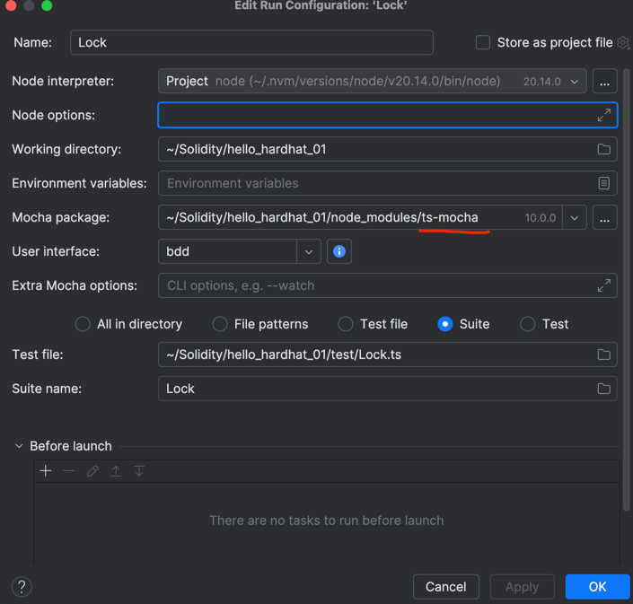

# Sample Hardhat Project
hardhat官网：https://hardhat.org/hardhat-runner/docs/getting-started#overview

This project demonstrates a basic Hardhat use case. It comes with a sample contract, a test for that contract, and a Hardhat Ignition module that deploys that contract.

Try running some of the following tasks:
## init
```shell
npx hardhat init
```
> 可以选择js或者ts模版

## run
```shell
npx hardhat help
# 测试合约
npx hardhat test
npx hardhat test ./test/Inherit.js

REPORT_GAS=true npx hardhat test
npx hardhat node
npx hardhat ignition deploy ./ignition/modules/Lock.js
```

### 在WebStorm中调试hardhat
- js模板项目，如果想直接使用测试文件中的播放按钮，需要在test文件夹中的测试文件导入包`const { ethers } = require("hardhat");`,如果直接使用命令行（npx hardhat test）则不需要

- ts模板项目，如果想直接使用测试文件中的播放按钮，需要配置Mocha为ts-mocha, 安装ts-mocha: `npm i -D ts-mocha`(npm install --save-dev ts-mocha), 然后配置mocha。(有时候需要先执行下`npx hardhat test`)。参考：https://stackoverflow.com/questions/68136436/debug-hardhat-solidity-tests-in-webstorm

> 注：更推荐直接使用命令行`npx hardhat test`运行，报错信息更直观